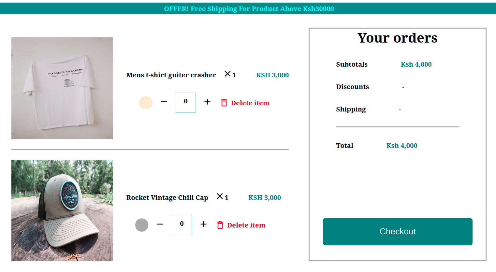
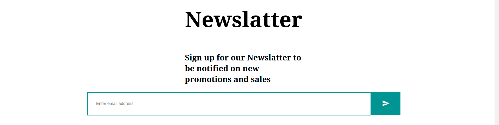

#MAGOSO ECOMMERCE
---
##DESCRIPTION
This is the official website for Magoso Enterprise ,Where you can buy varieties of different clothings and accessories.Delivery Is Free.

___
##Project Link
You can view the Live Project [here]()


## Project screenshots.




___

##Setup and Installation
To run this application in your local computer do the following:
-Clone the project to your desired location using this commands:
``` git clone https://github.com/samokello/Ecommerce.git ```
___
- Navigate to the project directory using:```cd Ecommerce```
- Open the project using your favorite text editor egIn VS Code use ```code .```
- Install all the dependencies using ```npm install``` (to use npm you must have [node](https://nodejs.org/en/) installed)
- Run ```npm start```
___

## Technologies used 
- HTML5
- CSS3
- Node.js v.16.13.0
- Javacript(ES6)
- React v.17.0.2
- Material UI v.5.1.0
- React-Dom v.17.0.2 
- React-Router-Dom v.6.0.2


___
## Known Bugs
Make sure you use the LTS version of Node


## License
MIT License

Copyright (c) [2021] [SAM OKELLO]

Permission is hereby granted, free of charge, to any person obtaining a copy
of this software and associated documentation files (the "Software"), to deal
in the Software without restriction, including without limitation the rights
to use, copy, modify, merge, publish, distribute, sublicense, and/or sell
copies of the Software, and to permit persons to whom the Software is
furnished to do so, subject to the following conditions:

The above copyright notice and this permission notice shall be included in all
copies or substantial portions of the Software.

THE SOFTWARE IS PROVIDED "AS IS", WITHOUT WARRANTY OF ANY KIND, EXPRESS OR
IMPLIED, INCLUDING BUT NOT LIMITED TO THE WARRANTIES OF MERCHANTABILITY,
FITNESS FOR A PARTICULAR PURPOSE AND NONINFRINGEMENT. IN NO EVENT SHALL THE
AUTHORS OR COPYRIGHT HOLDERS BE LIABLE FOR ANY CLAIM, DAMAGES OR OTHER
LIABILITY, WHETHER IN AN ACTION OF CONTRACT, TORT OR OTHERWISE, ARISING FROM,
OUT OF OR IN CONNECTION WITH THE SOFTWARE OR THE USE OR OTHER DEALINGS IN THE
SOFTWARE.
___
## Contact Information 
In case of queries you can reach me on Email: samokello024@gmail.com

___
## Author
***SAM OKELLO***


